# **Integrating OAuth with AI Agents and the A2A Protocol for Secure Authentication and Authorization**


### **Executive Summary**

Securing autonomous AI agents within distributed systems is a critical challenge, driven by the imperative for robust trust, accountability, and compliance with evolving mandates like zero-trust principles. This report proposes the strategic integration of established OAuth 2.0 infrastructure with emerging Agent2Agent (A2A) protocols to support secure, scalable, and auditable agent communication. It outlines technical strategies for implementing robust machine-to-machine (M2M) OAuth flows, defining granular permissions, and enabling verifiable authenticated delegation. The report further explores advanced patterns such as Dynamic Client Registration (DCR), OAuth Token Exchange, and application-layer security, offering a roadmap for building resilient, auditable, and secure multi-agent architectures that can scale with confidence.

### **1\. Introduction: Securing the Autonomous AI Agent Ecosystem**

#### **1.1 The Rise of AI Agents and Multi-Agent Systems**

The landscape of artificial intelligence is rapidly evolving beyond static models to dynamic, autonomous entities known as AI agents. An agent is defined as a virtual (or physical) autonomous entity that comprehends its environment and acts upon it, often communicating with other agents to achieve common goals that a single agent could not accomplish alone.1 Unlike simpler AI assistants or bots, AI agents possess reasoning, planning, and memory capabilities, demonstrating a higher degree of autonomy to make decisions, learn, and adapt.2 These capabilities are significantly enhanced by generative AI and foundation models, allowing agents to process multimodal information and engage in complex, multi-step actions.2

The emergence of multi-agent systems, where multiple AI agents collaborate or compete towards shared or individual objectives, amplifies the need for sophisticated communication and coordination mechanisms.2 These systems can simulate complex human behaviors and leverage diverse agent capabilities to tackle intricate tasks.2 The term "agentic workflows" refers to these complex, multi-step processes orchestrated by autonomous AI agents, often involving interactions with other agents, tools, and external services.

#### **1.2 The Identity Challenge for Autonomous Agents**

Traditional Identity and Access Management (IAM) frameworks, such as OAuth and SAML, were primarily designed for human users or static machine identities.3 Their inherent assumption is a predictable interaction model, often involving direct user consent or pre-configured machine credentials. However, the defining characteristics of AI agents—their autonomy, decision-making abilities, learning capacity, and adaptability 2—fundamentally alter the concept of a "principal" in security. An agent's identity is not merely a static credential but must reflect its dynamic state, evolving capabilities, and the specific authority delegated to it. This shift from human-driven or static machine processes to autonomous, dynamic agents necessitates a re-evaluation and adaptation of existing identity paradigms to support these new forms of digital actors, as traditional IAM models, while foundational, are inherently limited in addressing the unique requirements of these intelligent entities.3 The core challenge extends beyond simply authenticating a machine to authenticating an intelligent, autonomous entity that can act independently or on behalf of others, requiring a more nuanced approach to delegation and authorization.

The concept of agents performing tasks "on behalf of users" 2 introduces a critical security dimension: authenticated delegation. It is insufficient for an agent merely to prove its own identity; it must also cryptographically prove who authorized it and what it is permitted to do within that delegated authority.4 This requirement goes significantly beyond typical machine-to-machine (M2M) authentication, where the machine itself is often the primary principal. The necessity for authenticated delegation directly leads to a demand for robust auditability.4 Every action undertaken by an agent must be traceable back to its origin, including the human delegator and the precise permissions granted. This ensures accountability within highly autonomous and distributed systems, effectively mitigating risks associated with scope misalignment or resource abuse.4

#### **1.3 Report Objectives and Scope**

This report aims to provide a comprehensive and practical guide for organizations seeking to integrate their existing OAuth services with AI agents and the emerging A2A protocol. It will detail the technical considerations, best practices, and advanced patterns necessary to establish secure, scalable, and auditable authentication and authorization for autonomous AI agents.

### **2\. Unique Identity Needs of AI Agents**

#### **2.1 Core Characteristics and Their Security Implications**

AI agents are sophisticated software systems that leverage artificial intelligence to pursue goals and complete tasks on behalf of users.2 Key characteristics that differentiate them from simpler bots or assistants include:

* **Autonomy:** AI agents exhibit the highest degree of autonomy, capable of operating and making decisions independently to achieve a goal.2 This requires dynamic authorization policies and mechanisms for real-time privilege adjustment.  
* **Reasoning, Planning, and Memory:** They demonstrate capabilities for reasoning, planning, and maintaining context through various memory types (short-term, long-term, consensus, episodic), allowing them to learn from experiences and adapt over time.2 Their identity must support context retention, learning from past interactions, and evolving capabilities.  
* **Communication and Collaboration:** Agents are typically designed to communicate with other agents within the same system to achieve common goals that a single agent could not accomplish alone.1 This demands secure, interoperable agent-to-agent authentication and authorization.  
* **Goal-Oriented and Proactive:** Their primary purpose is to autonomously and proactively perform complex, multi-step actions.2 This necessitates robust delegation of authority and granular permissions for specific tasks.  
* **Multimodal Capacity:** Enabled by generative AI and foundation models, agents can process and reason with multimodal information such as text, voice, video, audio, and code simultaneously.2 The identity system must support diverse data types and interaction modalities for access control.  
* **Delegation:** Agents pursue goals and complete tasks *on behalf of users*.2 This requires verifiable "authenticated delegation" from human users or other agents, with clear accountability.4

#### **2.2 Why Traditional Identity Models Fall Short for Agents**

Traditional identity management systems like OAuth and SAML, while foundational for human users and static machine identities, exhibit limitations when applied to the dynamic world of AI agents.3 These protocols are primarily designed for static permissions assigned to human users and applications with well-defined scopes. However, AI agents require more granular and adaptive access control mechanisms, as their permissions may need to change dynamically based on contextual factors such as risk levels, mission objectives, or real-time data analysis.3

SAML, with its reliance on XML-based assertions and static session-based authentication, is less suited for AI agents that may require continuous authentication and real-time privilege adjustments. Its heavy reliance on user attributes also does not align well with AI-driven interactions, where contextual and behavioral factors should influence access decisions.3 A critical limitation of both OAuth and SAML in this context is their trust-based model, which often assumes that once an entity is authenticated, it remains trustworthy throughout the session. AI agents, however, introduce complexities such as adversarial attacks, evolving intent, and changing operational contexts, necessitating continuous validation rather than one-time authentication.3 These shortcomings underscore the need for dynamic identity management solutions better suited to AI-driven environments.

This challenge of continuous trust and dynamic privilege adjustment is central to securing AI agent interactions. Unlike human users who operate within relatively predictable sessions, autonomous agents can operate continuously, learn, and adapt, potentially altering their behavior or intent. This inherent dynamism means that a security model based on a "trust once, trust always" approach within a session is insufficient. Instead, there is a clear requirement for continuous validation of an agent's identity and its authorized scope, allowing for real-time adjustments to privileges based on ongoing context and observed behavior. This moves beyond static roles and scopes to a more dynamic, contextual authorization model, which traditional OAuth and SAML, in their conventional implementations, struggle to accommodate.

#### **2.3 Core Authentication and Authorization Requirements for Agents**

Given the unique characteristics and limitations of traditional models, robust authentication and authorization for AI agents must address several core requirements:

* **Identity Verification for Agents:** Each agent must possess a verifiable digital identity that can be authenticated across different systems and domains.4 This identity should be unique and cryptographically linked to the agent instance.4  
* **Delegated Authority:** Agents often act on behalf of human users or other agents. The system must support authenticated delegation, allowing human users to securely delegate and restrict permissions and scope to agents while maintaining a clear chain of accountability.4 This includes verifying that the agent is acting on behalf of a specific human user and within the granted authorization.4  
* **Granular Permissions:** Access control for agents must be fine-grained, allowing specific read or write permissions to particular resources or actions rather than broad, all-encompassing access.7 This aligns with the principle of least privilege, minimizing the impact of a compromised agent.7  
* **Auditability and Accountability:** All critical actions performed by agents, including token issuance and validation events, must be logged and auditable.4 This enables tracing actions back to the agent, the delegating user, and the specific credentials used, ensuring accountability in autonomous systems.4  
* **Secure Communication:** Agent-to-agent and agent-to-service communications must be secured end-to-end, protecting data in transit and ensuring the integrity and confidentiality of messages.10 This includes leveraging modern TLS versions and strong cipher suites.10

### **3\. Leveraging Existing OAuth 2.0 for Machine-to-Machine (M2M) Agent Communication**

OAuth 2.0, a battle-tested standard for authorization, provides a strong foundation for securing AI agent communications, particularly through its Machine-to-Machine (M2M) flows.

#### **3.1 OAuth 2.0 Client Credentials Flow: The Foundation for Agent Identity**

The OAuth 2.0 Client Credentials flow is specifically designed for M2M communication, where a client application (such as an AI agent) needs to authenticate itself and obtain an access token to interact with a server or API without direct user interaction.12 This flow is commonly used for communication between microservices, server-to-server interactions, and daemons.12

The process involves the client application sending a request to the OAuth Authorization Server's token endpoint, including its unique `client_id` and `client_secret` (or other authentication methods) along with the `grant_type` set to `client_credentials`.12 Optionally, a `scope` parameter can be included to specify the level of access or specific resources the client needs.12 Upon successful validation of the credentials, the Authorization Server issues an access token, typically a JSON Web Token (JWT).12 This JWT contains claims such as the issuer (`iss`), subject (`sub`), audience (`aud`), expiration time (`exp`), and optionally, the granted scopes.6 The client then validates this token and includes it in the HTTP `Authorization` header as a bearer token for subsequent requests to protected resources.12 The resource server, in turn, validates the token before granting access.12

**Table 2: OAuth 2.0 Client Credentials Flow for Agents**

| Step | Actor | Action | Key Parameters/Components |
|:-----|:------|:-------|:--------------------------|
| **1. Request Token** | Client Agent | Sends POST request to Authorization Server's token endpoint | `grant_type=client_credentials`<br/>`client_id`, `client_secret`<br/>`scope` (optional)¹² |
| **2. Validate & Issue** | Authorization Server | Validates client credentials and issues Access Token (JWT) | JWT containing `iss`, `sub`, `aud`, `exp`, `scopes`⁶ |
| **3. Receive & Validate** | Client Agent | Receives and validates Access Token | JWT signature validation<br/>`exp`, `nbf`, `iss`, `aud` claims¹² |
| **4. Access Resource** | Client Agent | Includes token in API requests to Resource Server | `Authorization: Bearer <access_token>`¹² |
| **5. Resource Validation** | Resource Server | Validates token and grants access if valid | JWT validation logic<br/>Scope checks, ACLs¹² |

**Alternative Text Flow (for better compatibility):**
```
OAuth 2.0 Client Credentials Flow:

Step 1: 🤖 CLIENT AGENT
        → POST to /token endpoint
        → Parameters: grant_type=client_credentials, client_id, client_secret, scope

Step 2: 🛡️ AUTHORIZATION SERVER  
        → Validates credentials
        → Issues JWT with: iss, sub, aud, exp, scopes

Step 3: 🤖 CLIENT AGENT
        → Receives & validates JWT
        → Checks: signature, exp, nbf, iss, aud claims

Step 4: 🤖 CLIENT AGENT
        → API Request with: Authorization: Bearer <access_token>

Step 5: 📦 RESOURCE SERVER
        → Validates JWT signature, expiration, issuer, audience
        → Checks scopes & ACLs → Grants access if valid
```

#### **3.2 Best Practices for Secure M2M OAuth Implementation**

Implementing OAuth for AI agents requires adherence to stringent security practices to mitigate inherent risks in automated, autonomous systems.

##### **3.2.1 Secure Client Credential Management**

Protecting client IDs and secrets is paramount. Credentials should never be hardcoded into source code or committed to version control.9 Instead, secure storage services such as secret managers (e.g., AWS Secrets Manager, HashiCorp Vault) should be used to store and inject credentials securely at runtime.9 A critical practice is to assign unique credentials to each machine or service, rather than sharing one API key across multiple services.9 This reduces the "blast radius" of a compromise, as an attacker gaining access to one service would not automatically gain access to everything else.16

##### **3.2.2 Short-Lived Access Tokens and Rotation Strategies**

Access tokens issued to AI agents should be short-lived, ideally expiring within 5 to 15 minutes for most M2M use cases.9 This minimizes the impact of a compromised token by quickly rendering it useless.7 While refresh tokens are commonly used in user-based OAuth flows to obtain new access tokens without re-authentication 19, it is important to note that refresh tokens are rarely issued or used in M2M client credentials flows.18 This is because M2M clients can typically re-authenticate themselves repeatedly without requiring user interaction.18 Therefore, for most agent-to-agent or agent-to-service communication using Client Credentials, the focus should be on robust access token expiry handling and regular, automated rotation of client secrets, rather than relying on refresh tokens.18

Automated rotation of client secrets on a regular schedule (e.g., every 90 days or less) is a critical security practice.9 This process should involve generating a new secret, updating it in the secure secrets manager, and then revoking the old one after confirming the transition.9 Automation through CI/CD pipelines, cron jobs, or serverless functions can facilitate these rotations without disrupting service communications and reduce the chances of human error.18

##### **3.2.3 Asymmetric Client Authentication (Private Key JWT)**

For a higher level of assurance, OAuth providers increasingly support asymmetric client authentication, such as using Private Key JWTs or mTLS (mutual TLS), instead of shared secrets.13 In this approach, the client authenticates by signing a JWT with its private key, which the Authorization Server verifies using the corresponding public key.18 This method offers several advantages:

* **No Shared Secrets:** Eliminates the risk associated with transmitting or storing shared client\_secret values.18  
* **Better Auditability:** Cryptographic signatures provide stronger non-repudiation.18  
* **Support for Rotation via Key Pairs:** Private keys can be rotated through key pairs, adding another layer of cryptographic assurance.18  
* **Certificate-Based Authentication:** Utilizing X.509 certificates for client authentication provides strong identity verification and supports renewal, offering stronger security than passwords for machines.16

#### **3.3 JWT Claims for Agent Identity and Capabilities**

JSON Web Tokens (JWTs) are a highly suitable format for access tokens in agent-based systems due to their self-contained nature, allowing information about the agent and its permissions to be carried within the token itself.12 This enables stateless verification by resource servers, reducing the need for multiple database queries.21

##### **3.3.1 Standard Claims for Agent Identification**

JWTs contain a set of claims, which are statements about an entity. Several standard (registered) claims are highly relevant for agent identification:

* **iss (Issuer):** Identifies the entity that issued the JWT (e.g., the OAuth Authorization Server).6  
* **sub (Subject):** Identifies the principal that is the subject of the JWT (i.e., the AI agent's unique identifier).6  
* **aud (Audience):** Identifies the recipients that the JWT is intended for (e.g., the specific API or service the agent intends to access).6  
* **exp (Expiration Time):** Specifies the time on and after which the JWT must not be accepted for processing.6  
* **iat (Issued At Time):** Indicates the time at which the JWT was issued, useful for determining token age.21  
* **jti (JWT ID):** A unique identifier for the JWT, which can be used to prevent replay attacks by ensuring the token is used only once.22

##### **3.3.2 Custom Claims for Granular Agent Context and Capabilities**

Beyond standard claims, custom (non-registered) claims can be included in JWTs to provide more granular context about the agent and its specific capabilities.22 These claims enable richer authorization decisions and better auditability. Examples include:

* **agent\_type:** (e.g., "PaymentAgent", "DiagnosticAgent", "LogisticsAgent").  
* **capabilities:** A list or structured object detailing the specific functions or tools the agent is authorized to use (e.g., "read\_patient\_records", "generate\_reports", "request\_payment").  
* **delegated\_user\_id:** If the agent is acting on behalf of a human user, this claim links the agent's actions to the specific user who delegated authority.4  
* **organization\_id / tenant\_id:** Identifies the organizational context the agent belongs to, crucial for multi-tenant environments.7  
* **policy\_version:** Indicates the version of the authorization policy under which the token was issued, aiding in policy updates and revocation.

It is important to be mindful of payload size limitations for custom claims, as some servers may not accept headers larger than 8 KB.22

##### **3.3.3 Exploring Selective Disclosure (SD-JWT) for Agent Cards**

An emerging concept, SD-JWT (Selectively Disclosable JWT), is particularly relevant for agent identity and capability advertisement through "Agent Cards".23 SD-JWT allows for the selective revelation of specific agent capabilities, contact information, and operational metadata while maintaining cryptographic integrity and preventing correlation across different interaction contexts.23 This specification is currently under development in the IETF as [draft-nandakumar-agent-sd-jwt](https://datatracker.ietf.org/doc/draft-nandakumar-agent-sd-jwt/).23 This means an agent can present only the necessary information to a requesting entity, enhancing privacy and security by minimizing data exposure. Key binding within SD-JWT provides cryptographic proof that the presenter of an SD-Card possesses the private key corresponding to the public key in the SD-Card's

cnf claim, further strengthening identity verification.23 This is an

**emerging concept** and not yet a widely deployed standard.

**Table 3: Recommended JWT Claims for AI Agent Identity and Capabilities**

| Claim Type | Claim Name | Description | Example Value | Relevance for Agents |
|:-----------|:-----------|:------------|:--------------|:---------------------|
| **📋 Registered** | `iss` | Issuer of the JWT | `https://auth.example.com` | Identifies the trusted authority that issued the agent's token⁶ |
| | `sub` | Unique identifier of the agent | `agent-id-12345` | Establishes the agent's unique digital identity⁶ |
| | `aud` | Intended recipient of the token | `https://api.example.com/payments` | Ensures token is used only by intended service/API⁶ |
| | `exp` | Expiration time of the token | `1701388800` (Unix timestamp) | Enforces short-lived tokens, reducing compromise window⁶ |
| | `iat` | Time the token was issued | `1701385200` | Useful for auditing and determining token age²¹ |
| | `jti` | Unique JWT ID | `uuid-v4-token-id` | Prevents replay attacks for single-use tokens²² |
| **🎛️ Custom** | `agent_type` | Categorization of the agent | `PaymentProcessor`, `DataAnalyst` | Enables role-based or type-based authorization policies |
| | `capabilities` | List of specific functions/tools agent can use | `["process_payment", "refund_transaction"]` | Granular authorization, aligns with agent's advertised functions |
| | `delegated_user_id` | Human user ID on whose behalf the agent acts | `user_abc@example.com` | Critical for authenticated delegation and human accountability⁴ |
| | `organization_id` | Organizational context of the agent | `org_xyz` | Essential for multi-tenant SaaS environments and organizational policies⁷ |
| | `policy_version` | Version of authorization policy applied | `v1.2` | Supports dynamic policy updates and revocation tracking |
| **🔬 Emerging** | SD-JWT Claims | Selective disclosure of agent metadata/capabilities | `_sd`, `_sd_alg`, `cnf` | Enhances privacy and controlled capability advertisement in Agent Cards²³ |

**Quick Reference for JWT Claims (text format):**

```
📋 STANDARD CLAIMS:
   • iss (Issuer): Who issued the token → https://auth.example.com
   • sub (Subject): Agent's unique ID → agent-id-12345  
   • aud (Audience): Intended recipient → https://api.example.com/payments
   • exp (Expiration): When token expires → 1701388800
   • iat (Issued At): When token was created → 1701385200
   • jti (JWT ID): Unique token identifier → uuid-v4-token-id

🎛️ CUSTOM CLAIMS:
   • agent_type: Agent category → PaymentProcessor, DataAnalyst
   • capabilities: What agent can do → ["process_payment", "refund_transaction"]
   • delegated_user_id: Human who authorized → user_abc@example.com
   • organization_id: Organizational context → org_xyz
   • policy_version: Policy version applied → v1.2

🔬 EMERGING CLAIMS:
   • SD-JWT: Selective disclosure → _sd, _sd_alg, cnf (privacy-preserving)
```

#### **3.4 Defining Granular Scopes for Agent Permissions**

The principle of least privilege dictates that agents should only be granted the minimum necessary permissions to perform their designated tasks.7 OAuth scopes are an effective mechanism to achieve this, allowing an application's access to be limited to specific areas and functionalities.7

When defining scopes for AI agents, it is highly beneficial to align them with existing permission models within the organization.7 For instance, if an application already has "reader" and "editor" roles, corresponding OAuth scopes should be created (e.g.,

data:read, data:write).7 The practice of creating a single, all-encompassing "allows-everything" scope should be avoided, as it leads to over-provisioning of access and increased risk.7 Scopes should follow existing role inheritance patterns, avoiding the creation of a separate hierarchy solely for OAuth purposes.7

A crucial aspect of managing agent permissions is the distinction between user-level and organizational-level permissions.7 If an agent requires access to a specific user's calendar, that permission should be tied to that user's identity. Conversely, if an agent needs broader access to organizational resources, such as a shared knowledge base, the permission should be tied to the organization's context.7 This allows for precise control and ensures that sensitive or broad access is granted only when appropriate and auditable. Furthermore, it is advisable to restrict the ability to generate OAuth tokens with the most sensitive or permissive scopes to administrative users only.7

The interplay of scopes, agent capabilities, and delegated authority creates a complex authorization matrix for AI agents. Granular scopes are not merely about limiting access; for agents, they must dynamically align with the agent's advertised capabilities (often published in Agent Cards 3) and the specific authority delegated by a human user.4 This means that the scopes in an agent's access token should reflect not only what the agent

*can do* (its inherent capabilities), but also what it *is allowed to do* (its assigned permissions), and critically, what it *is authorized to do on behalf of someone* (the scope of human delegation). This multi-faceted authorization requirement implies a need for sophisticated policy engines capable of evaluating these combined claims in real-time.

Finally, every action taken with an OAuth token by an agent should be meticulously logged with both the token identifier and the associated user or organizational context in audit logs.7 This ensures a clear audit trail and accountability for autonomous actions.

### **4\. Integrating with the Agent2Agent (A2A) Protocol for Interoperable Security**

The Agent2Agent (A2A) Protocol is an open standard designed to enable secure, scalable, and seamless collaboration between autonomous AI agents across different frameworks, vendors, and domains.24 It provides a standardized, vendor-neutral protocol for agents to discover each other, share capabilities, delegate tasks, and coordinate complex workflows.24

#### **4.1 A2A Protocol Overview: Enabling Seamless Agent Collaboration**

A2A leverages common web standards such as HTTP, JSON-RPC requests, and Server-Sent Events (SSE) to ensure reliable communication while providing essential security, auditing, and compliance guardrails for enterprise use.24 It supports rich data exchange and asynchronous push notifications, enabling AI agents to manage long-running tasks efficiently.24 The protocol establishes a common language and framework, allowing agents to communicate effectively across diverse systems and enabling them to negotiate interaction modalities.24 A2A's goal is to scale enterprise-level agentic systems, allowing coordination of hundreds or thousands of autonomous agents across distributed environments without bottlenecks.10 It enables dynamic composition and optimization of workflows by allowing agents to share real-time task updates and intermediate artifacts.10

#### **4.2 A2A's Built-in Security Mechanisms and OAuth Alignment**

Security and authentication are critical components of the A2A protocol, ensuring that agents can communicate securely and trust each other's identities.24 A2A treats each agent as a first-class, HTTP-based enterprise application, leveraging existing infrastructure rather than inventing new protocols.10 At its core, A2A requires that every interaction happens over HTTPS with modern TLS versions (1.2 or higher) and strong cipher suites, ensuring data in transit cannot be snooped or tampered with.10

A2A incorporates enterprise-grade authentication and authorization mechanisms, supporting OpenAPI authentication schemes.26 Agents advertise their authentication requirements in their Agent Cards, including support for OAuth2, mTLS, API keys, or OpenID Connect.26 Clients obtain and present these credentials out of band, never embedding secrets inside the JSON-RPC payload itself.10

The design of A2A as an "identity-aware" and "secure by default" protocol 26 is a significant advantage for organizations with existing OAuth infrastructure. Its direct support for OAuth2 and other standard authentication schemes means that an existing OAuth service can directly fulfill A2A's authentication requirements. This architectural choice simplifies integration, allowing organizations to extend their current identity management capabilities to the emerging agent ecosystem. This alignment positions A2A as a de facto standard for secure AI agent interoperability on the web.10

Beyond authentication, A2A provides centralized security and governance capabilities, enforcing mTLS, Role-Based Access Control (RBAC), quotas, and Data Loss Prevention (DLP) policies at the gateway level, shielding agents from direct exposure.24 It also supports schema and payload validation, redaction of sensitive data, and normalization of API versions to prevent schema drift and data leakage.24 For auditability, A2A offers end-to-end observability, utilizing OpenTelemetry-powered tracing to connect every agent interaction into a unified span for audit and fast incident response.24

#### **4.3 Agent Cards: Advertising Capabilities and Authentication Requirements**

A cornerstone of the A2A protocol is the concept of "Agent Cards." These are standardized, machine-readable JSON documents that every A2A-compliant agent exposes.26 Agent Cards detail an agent's identity, capabilities, endpoints, supported message types, authentication requirements, and operational metadata.26 The process of an agent publicly declaring its functions and security requirements through these cards is referred to as "capability advertisement."

Agent Cards serve a dual purpose: they function as a service discovery mechanism (describing what an agent *can do*) and as an advertisement of the agent's identity and security posture (how to *authenticate and authorize* it).26 By explicitly detailing authentication requirements, Agent Cards become a critical component for establishing trust and enabling secure communication

*before* interaction. This moves beyond simple endpoint discovery to a security-first discovery mechanism, where agents can programmatically understand the security expectations of their peers.26 This dynamic discovery, coupled with explicit authentication requirements, enables dynamic task negotiation and collaboration between agents.24 The emerging SD-Card format, based on SD-JWT, further refines this by allowing granular, privacy-preserving selective disclosure of agent capabilities, ensuring that only necessary information is shared in specific contexts while maintaining cryptographic integrity.23

#### **4.4 A2A in Multi-Agent Systems: Secure Task Delegation and Communication**

In multi-agent systems, A2A facilitates secure task delegation and communication between a "client" agent (user-facing, receiving tasks from a user) and one or more "remote" agents (A2A servers, best suited to perform a delegated task).10 Through a shared protocol and discovery mechanisms, agents can:

* Identify and understand each other's capabilities.24  
* Exchange structured messages and context using message objects and data fields.24  
* Collaborate on tasks while preserving security and privacy policies.24  
* Manage long-running tasks with event-driven status updates and push notifications.24

A2A maintains state across multi-step interactions, allowing each stage of a task (sending inputs, receiving partial or final outputs) to be correlated correctly.10 This is crucial for complex workflows involving multiple back-and-forth exchanges between agents.

#### **4.5 Comparison with Related Protocols: A2A, MCP, and ACP**

It is important to understand A2A's role in the broader landscape of agent communication protocols, particularly in relation to Model Context Protocol (MCP) and Agent Communication Protocol (ACP). These protocols address different layers or aspects of the agentic AI stack and are often complementary rather than competing.27

* **A2A (Agent-to-Agent Protocol):** Focuses on connecting agents to other agents, enabling peer-to-peer collaboration, task delegation, and distributed problem-solving.27 It standardizes how agents from different vendors or runtimes can exchange capabilities and coordinate workflows over the open web.28 Its security model is built on web standards, including OAuth 2.0 and API key-based authorization, with capability-scoped endpoints.28  
* **MCP (Model Context Protocol):** Focuses on connecting agents to external tools and data sources (e.g., APIs, databases, file systems).27 It enables agents to access structured context needed to perform useful actions.28 MCP is compatible with enterprise authentication standards like OAuth2 and mTLS.28  
* **ACP (Agent Communication Protocol):** Developed by IBM, ACP focuses on local-first, real-time agent orchestration within a shared runtime, prioritizing low-latency coordination, resilience, and composability.28 It defines REST-based interfaces for agents to interact and share resources in a distributed system.29 ACP supports "scale-to-zero" environments by enabling offline discovery via embedded metadata.30 While ACP enables agent orchestration and communication, specific details on its security features and integration with external identity providers are less explicitly defined in the provided information compared to A2A and MCP, though it is designed for enterprise integration and auditability.28

**Table 4: Comparison of Agent Communication Protocols (A2A, MCP, ACP) Security Features**

| Feature/Protocol | A2A (Agent-to-Agent Protocol) | MCP (Model Context Protocol) | ACP (Agent Communication Protocol) |
| :---- | :---- | :---- | :---- |
| **Primary Focus** | Agent-to-agent communication, collaboration, task delegation 27 | Agent-to-tool/data access, providing external context to models 27 | Local-first agent orchestration, intra-runtime communication, workflow delegation 28 |
| **Communication Model** | HTTP, JSON-RPC 2.0, Server-Sent Events (SSE) 24 | JSON-RPC for tool calls 30 | REST-based communication, HTTP conventions 30 |
| **Security Mechanisms** | OAuth 2.0, API keys, mTLS, OpenID Connect; HTTPS/TLS 1.2+; capability-scoped endpoints; centralized governance; schema validation 24 | Compatible with API gateways, OAuth2, mTLS, enterprise authentication standards 28 | Designed for local sovereignty; less explicit detail on specific external identity integration in provided material 28 |
| **Identity Advertisement** | Agent Cards (JSON documents detailing capabilities, auth requirements) 26 | Implicit via tool/API definitions; context-aware responses 11 | Offline discovery via embedded metadata 30 |
| **Scalability Vision** | Scales enterprise-level agentic systems, coordinates thousands of agents across distributed environments 10 | Enhances individual agent capabilities by providing access to external functionalities 11 | Orchestrates workflows, delegates tasks, maintains state across multiple agents; supports scale-to-zero 29 |
| **Interoperability** | Framework-agnostic, vendor-neutral 24 | Universal integration with APIs, databases, tools 11 | Allows agents to communicate across different frameworks/stacks 30 |

**Alternative Protocol Comparison (simplified view):**

```
🌐 A2A (Agent-to-Agent Protocol)
   Focus: Agent-to-agent communication & collaboration
   Transport: HTTP, JSON-RPC 2.0, Server-Sent Events
   Security: OAuth 2.0, mTLS, OpenID Connect, TLS 1.2+
   Discovery: Agent Cards (JSON capability documents)
   Scale: Enterprise-level, thousands of distributed agents

🔧 MCP (Model Context Protocol)  
   Focus: Agent-to-tool/data access & external context
   Transport: JSON-RPC for tool calls
   Security: API gateways, OAuth2, mTLS compatible
   Discovery: Implicit via tool/API definitions
   Scale: Enhances individual agent capabilities

🏠 ACP (Agent Communication Protocol)
   Focus: Local-first orchestration & intra-runtime communication
   Transport: REST-based, HTTP conventions  
   Security: Local sovereignty design (limited external identity detail)
   Discovery: Offline via embedded metadata
   Scale: Workflow orchestration, scale-to-zero support
```

### **5\. Advanced Authentication and Authorization Patterns for Agentic Workflows**

As agentic systems mature and scale, more sophisticated authentication and authorization patterns become necessary to manage their lifecycle and interactions securely.

#### **5.1 Dynamic Client Registration (DCR): Automating Agent Onboarding at Scale**

Dynamic Client Registration (DCR) is an extension of the OAuth 2.0 specification that allows client applications, including AI agents and microservices, to register themselves programmatically with an authorization server at runtime, without manual human intervention.20 This eliminates the need for pre-provisioning clients and is particularly beneficial for managing ephemeral clients, such as AI agents that spin up temporarily.20 DCR fits seamlessly into modern automation pipelines like GitOps and CI/CD, enabling efficient, automated workflows and reducing credential reuse by isolating each client with unique credentials and permissions.20

The DCR process involves the client sending a JSON payload containing its metadata (e.g., client\_name, redirect\_uris, grant\_types, token\_endpoint\_auth\_method) to the authorization server's client registration endpoint.20 The server then responds with a unique

client\_id, potentially a client\_secret, and other metadata, including a registration\_access\_token for self-service management.33

For secure DCR, especially for autonomous agents, strong authentication methods are critical. Mutual TLS (mTLS) can validate the client at the network layer, ensuring only trusted workloads can register.20 Additionally, clients can prove their identity using signed JWTs as "software statements" during registration.20 While DCR can support "open registration" for any client, in enterprise environments, it is a necessity to enforce initial access tokens to protect the registration endpoint.33 These initial access tokens are typically obtained via the Client Credentials flow or a user interactive flow, and they signal that the registration request comes from an authorized entity.33

**Table 5: OAuth 2.0 Dynamic Client Registration (DCR) Security Best Practices for Agents**

| Practice | Description | Rationale for Agents |
| :---- | :---- | :---- |
| **Enforce Initial Access Tokens** | Require clients to present an initial access token (e.g., obtained via Client Credentials flow) to register.33 | Prevents unauthorized or malicious agents from freely registering, maintaining a secure perimeter for automated onboarding. |
| **Require Strong Client Authentication** | Utilize mTLS or Private Key JWTs for client authentication during registration.18 | Replaces vulnerable shared secrets with cryptographically stronger methods, enhancing trust and auditability for agent identities. |
| **Validate Client Metadata** | Rigorously validate the JSON payload submitted by the client during registration (e.g., client\_name, redirect\_uris, grant\_types).31 | Prevents misconfigurations or malicious inputs that could lead to security vulnerabilities or operational issues for agents. |
| **Implement Rate Limiting on Registration Endpoint** | Apply rate limits to the DCR endpoint to prevent abuse and Denial of Service (DoS) attacks.9 | Protects the authorization server from being overwhelmed by rapid, potentially malicious, agent registration attempts. |
| **Monitor Registration Events** | Log all DCR requests, including client metadata, initial access token usage, and registration outcomes.9 | Provides an audit trail for agent onboarding, enabling detection of suspicious activity or unauthorized registrations. |

#### **5.2 OAuth 2.0 Token Exchange (RFC 8693): Enabling Delegation and Least Privilege**

OAuth 2.0 Token Exchange (RFC 8693\) is an advanced grant type that allows a system to exchange an existing security token (the "subject token") for a new one with different attributes, such as altered scopes or audience.13 This mechanism is particularly valuable in multi-agent systems for enforcing the principle of least privilege and managing complex delegation scenarios.13

The token exchange flow enhances security by ensuring tokens are scoped appropriately, reducing risks from over-permissioned tokens.13 It is useful when an existing token is invalid or insufficient for accessing a specific resource or service.13 Key use cases for agents include:

* **Delegation of Authority:** An agent acting on behalf of a human user or another agent can exchange a token representing the delegator's identity for a new token that includes the agent's identity as an "actor" while still representing the original subject.13 This provides context about who is making the request while maintaining the original delegation chain.  
* **Principle of Least Privilege:** In complex multi-agent workflows, an agent might initially receive a broader token. For a specific sub-task requiring access to a sensitive resource, it can exchange this token for a new one with a precisely restricted scope, ensuring minimal access rights are granted at every step.13  
* **Cross-Domain Security:** Token exchange facilitates secure access to resources across different security domains. An agent with a token valid in one domain can exchange it for a token valid in another trusted domain, streamlining cross-system interactions without requiring re-authentication.13  
* **Impersonation:** An agent might need to act as a specific user or another agent for a particular task. Token exchange allows the creation of a new token that reflects this impersonated identity, with the original agent identified as the "actor".13  
* **Workflow Chaining:** In multi-step agentic workflows, where tasks are handed off sequentially, token exchange enables each subsequent agent or service to receive a refined token tailored to its specific role and required permissions for that stage of the workflow.

The token exchange protocol categorizes tokens into three types: the subject\_token (the existing token being exchanged), the actor\_token (an optional token representing the entity requesting the exchange on behalf of the subject), and the requested\_token (the newly issued token).13 Best practices for implementation emphasize robust policies on the authorization server to prevent privilege escalations and the use of the

scopes parameter to restrict the context in which the resulting access token is valid.13

**Table 6: OAuth 2.0 Token Exchange (RFC 8693\) Use Cases for Multi-Agent Systems**

| Use Case | Description | Agentic Scenario Example |
| :---- | :---- | :---- |
| **Delegation of Authority** | An agent acts on behalf of a human user or another agent, with the new token reflecting both the original subject and the acting agent. | A "User Assistant Agent" exchanges its user's token for a new token that identifies itself as the actor, allowing it to call a "Payment Agent" on the user's behalf. |
| **Principle of Least Privilege** | An agent requests a new token with a more granular scope for a specific sub-task, limiting its access to only what is required. | A "Data Analysis Agent" with broad read access exchanges its token for one with a specific financial\_data:read\_only scope before accessing sensitive financial APIs. |
| **Cross-Domain Access** | An agent needs to interact with services residing in different security domains or identity providers. | A "Logistics Agent" from Company A exchanges its token for one valid in Company B's domain to access Company B's shipping APIs. |
| **Impersonation** | An agent needs to perform actions as if it were a specific user or another agent within the system. | A "Customer Service Agent" exchanges its token to temporarily impersonate a customer's identity to troubleshoot a specific account issue. |
| **Workflow Chaining** | Sequential tasks where each step requires a refined or specialized token for the next stage of the workflow. | An "Order Processing Agent" receives an initial order token; it exchanges this for a "Payment Authorization Token" to interact with a payment gateway, then for a "Shipping Request Token" for a logistics service. |

#### **5.3 Application-Layer Security: Message Signing and Encryption for Enhanced Trust**

While Transport Layer Security (TLS/HTTPS) provides essential encryption for data in transit 10, for highly sensitive agent interactions, there is a growing necessity for additional application-layer security mechanisms. This approach ensures end-to-end protection of messages, regardless of intermediary hops or potential decryption at network layers.

Google's Application-Layer Transport Security (ALTS) is an example of a mutual authentication and transport encryption system that operates at the application layer to protect RPC communications.36 ALTS provides applications with an authenticated remote peer identity, which can then be used to implement fine-grained authorization policies.36 This allows application developers to focus on functional logic while security is handled transparently at a deeper level.

Message Level Encryption (MLE) using JSON Web Encryption (JWE) and JSON Web Signature (JWS) is another robust application-layer security technique.37

* **JWS (Message Signing):** Provides cryptographic integrity and non-repudiation. An agent can sign its messages using its private key, allowing the receiving agent to verify the message's authenticity and ensure it hasn't been tampered with in transit.21 This is crucial for establishing trust in multi-agent interactions where accountability is paramount.  
* **JWE (Message Encryption):** Provides end-to-end confidentiality for the message payload. Even if the transport layer (TLS) is terminated at an intermediary proxy, the message content remains encrypted until it reaches the intended recipient, which possesses the corresponding private key for decryption.37 This is particularly important for sensitive data exchanged between agents.

The Agent Network Protocol (ANP) also highlights the importance of an "Identity and Encrypted Communication Layer" based on W3C DID standards, providing decentralized identity authentication and end-to-end encrypted communication between agents.38

The increasing emphasis on application-layer security, beyond just TLS, indicates a significant shift towards end-to-end trust for agent communication. This suggests that for highly sensitive agent interactions, merely encrypting the transport layer is insufficient. Message signing (JWS) ensures integrity and non-repudiation, while message encryption (JWE) provides confidentiality *end-to-end*, even across intermediaries. This is a direct response to the "never trust, always verify" principle 6 and the potential for complex, multi-hop agent interactions where data might be exposed at intermediate processing points.

#### **5.4 Architectural Patterns for Agent Authorization: Centralized vs. Distributed**

When designing authorization for agent-based architectures, a key decision involves choosing between centralized and distributed authorization patterns.

* **Centralized Authorization Service:** This pattern involves a dedicated authorization service that manages all authorization data and logic.13 When other services or agents need to perform permission checks, they query this central service.39 This approach offers strong consistency in policy enforcement, simplifies policy management (as policies are stored as code in a single place, e.g., Cerbos 39), and allows for easier auditing. However, it introduces a single point of failure and can add latency due to network calls for every authorization decision.40  
* **API Gateway Pattern:** In this pattern, an API gateway sits between the client (agent) and the backend services.40 The gateway is responsible for both authentication and initial authorization, often fetching user/agent role information and attaching it to the request before forwarding it downstream.40 This simplifies downstream services, as they do not need to concern themselves with where role data originates.40 While offering architectural simplicity, the gateway can become a bottleneck and may not be suitable for very fine-grained authorization decisions that require deep context from backend services.  
* **Distributed Authorization:** In this model, each microservice or agent stores and enforces its own authorization information.39 This can offer high availability and low latency if data is local. However, it complicates policy consistency across the system, requires each service to manage its own authorization logic, and can lead to duplicated effort and potential inconsistencies if not managed carefully.39

The discussion of centralized versus distributed authorization highlights a critical architectural decision point for scalable agent systems. While centralized models (like an authorization service or API gateway) simplify policy management and consistency, they introduce single points of failure and potential latency. Distributed models offer resilience but complicate policy enforcement and consistency across a potentially vast number of autonomous agents. For dynamic, high-volume agent interactions, the choice will heavily influence performance, scalability, and security posture, requiring careful consideration of the trade-offs between consistency, latency, and operational complexity.

##### **Authorization Architecture Patterns Comparison**

The following diagram illustrates the three main architectural approaches for agent authorization:

```mermaid
flowchart TB
    subgraph CP ["🏢 Centralized Authorization Pattern"]
        CA1["🤖 Agent A"] --> AG1["🌐 API Gateway<br/>Initial Auth"]
        CA2["🤖 Agent B"] --> AG1
        CA3["🤖 Agent C"] --> AG1
        
        AG1 --> AS1["🔐 Central Auth Service<br/>Policy Engine"]
        AS1 --> M1["📦 Microservice 1"]
        AS1 --> M2["📦 Microservice 2"]
        AS1 --> M3["📦 Microservice 3"]
    end
    
    subgraph DP ["🌐 Distributed Authorization Pattern"]
        DA1["🤖 Agent A"] --> DM1["📦 Service 1<br/>Local Auth"]
        DA2["🤖 Agent B"] --> DM2["📦 Service 2<br/>Local Auth"]
        DA3["🤖 Agent C"] --> DM3["📦 Service 3<br/>Local Auth"]
        
        DM1 -.-> DM2
        DM2 -.-> DM3
        DM3 -.-> DM1
    end
    
    subgraph HP ["⚖️ Hybrid Pattern (Recommended)"]
        HA1["🤖 Agent A"] --> HG["🌐 API Gateway<br/>Auth + Routing"]
        HA2["🤖 Agent B"] --> HG
        
        HG --> HAS["🔐 Policy Engine<br/>Complex Decisions"]
        HG --> HS1["📦 Service 1<br/>Simple Local Auth"]
        HG --> HS2["📦 Service 2<br/>Simple Local Auth"]
    end
    
    style AS1 fill:#ffebee
    style HAS fill:#e8f5e8
    style HG fill:#f3e5f5
```



**Pattern Comparison:**

| Pattern | ✅ Advantages | ❌ Disadvantages |
|:--------|:-------------|:----------------|
| **Centralized** | Strong Consistency<br/>Centralized Policy | Single Point of Failure<br/>Latency |
| **Distributed** | High Availability<br/>Low Latency | Policy Consistency<br/>Complex Management |
| **Hybrid** | Best of Both<br/>Scalable<br/>Consistent Policies<br/>Performance | - |

### **6\. Open Challenges and Future Considerations for Agent Identity Management**

The evolving landscape of AI agents presents several challenges and areas for future development in identity management.

#### **6.1 Managing Human-to-Agent Delegation of Authority**

A significant challenge lies in securely managing the delegation of authority from human users to AI agents. This process often begins with a human user delegating a task to an AI agent via natural language.5 The agent must then translate these natural language instructions into a structured, machine-readable policy (e.g., using XACML or ODRL) that defines the scope and permissions for its actions.5 This translation from human intent to machine-executable policy can introduce a "semantic gap" (the disconnect between human natural language instructions and machine-executable policies), where the agent's interpretation may not perfectly align with the user's original meaning. A critical "human-in-the-loop" approval step is often required, where users review and explicitly approve the AI-generated policies before authorization is granted.5 This ensures alignment with the user's intent and prevents unauthorized scope escalation. Cryptographically signed "delegation tokens" are then issued, encoding the agent's permissions, user identity, and validity period, preventing tampering and unauthorized actions.5

##### **Delegation Flow Visualization**

The following diagram illustrates the complete delegation workflow from human authority to agent execution:

```mermaid
flowchart TD
    U["🧑 Human User<br/>Original Authority"] --> D1{"📝 Delegation Decision<br/>What can agent do?"}
    
    D1 --> P1["🔐 Policy Generation<br/>Natural Language → XACML/ODRL"]
    P1 --> A1{"✅ Human Approval<br/>Review & Authorize?"}
    
    A1 -->|"❌ Reject"| R1["🚫 Deny Access<br/>End Process"]
    A1 -->|"✅ Approve"| S1["📜 Sign Delegation Token<br/>Cryptographically Bound"]
    
    S1 --> CA["🤖 Client Agent<br/>Receives Delegated Authority"]
    
    CA --> T1["🎫 Token Exchange<br/>RFC 8693"]
    T1 --> ST["🔑 Scoped Token<br/>Principle of Least Privilege"]
    
    CA --> A2A{"🌐 A2A Protocol<br/>Agent-to-Agent?"}
    
    A2A -->|"Yes"| AC["📋 Agent Card Discovery<br/>Capabilities & Auth Requirements"]
    AC --> RA["🤖 Remote Agent<br/>Task Execution"]
    
    A2A -->|"No"| API["🔌 Direct API Access<br/>Resource Server"]
    
    RA --> AL["📊 Audit Log<br/>Action Traceability"]
    API --> AL
    
    AL --> CHN["🔗 Chain of Accountability<br/>User → Agent → Action"]
    
    style U fill:#e1f5fe
    style CA fill:#f3e5f5
    style RA fill:#f3e5f5
    style AL fill:#fff3e0
    style CHN fill:#e8f5e8
```



**Alternative Flow Diagram (if Mermaid doesn't render):**

```
Human-to-Agent Delegation Flow:

🧑 Human User (Original Authority)
    ↓
📝 DELEGATION DECISION: What can agent do?
    ↓
🔐 POLICY GENERATION: Natural Language → XACML/ODRL
    ↓
✅ HUMAN APPROVAL: Review & Authorize?
    ├─❌ REJECT → 🚫 Deny Access (End Process)
    └─✅ APPROVE → 📜 Sign Delegation Token (Cryptographically Bound)
         ↓
    🤖 CLIENT AGENT (Receives Delegated Authority)
         ├─🎫 Token Exchange (RFC 8693) → 🔑 Scoped Token (Least Privilege)
         └─🌐 A2A Protocol Decision: Agent-to-Agent?
              ├─YES → 📋 Agent Card Discovery → 🤖 Remote Agent (Task Execution)
              └─NO → 🔌 Direct API Access (Resource Server)
                   ↓
              📊 AUDIT LOG: Action Traceability
                   ↓
              🔗 CHAIN OF ACCOUNTABILITY: User → Agent → Action
```

**Key Components:**
- **🧑 Human Authority**: Original source of all permissions
- **📝 Policy Translation**: AI converts natural language to machine policies  
- **✅ Human-in-Loop**: Critical approval step prevents scope escalation
- **🔐 Cryptographic Binding**: Tamper-proof delegation tokens
- **🎫 Dynamic Scoping**: Token exchange for least privilege
- **📊 Full Auditability**: Complete traceability chain

#### **6.2 Continuous Authentication and Authorization for Dynamic Agent Behavior**

As discussed previously, the dynamic nature of AI agents, their learning capabilities, and potential for evolving intent necessitate a shift from one-time authentication to continuous validation and adaptive access control.3 Agents require more granular and adaptive access control mechanisms, as their permissions may need to change dynamically based on contextual factors.3 This implies the need for real-time authorization systems that can evaluate context, behavior, and risk levels continuously. Monitoring and auditing token requests and usage for unexpected activity patterns are essential to detect issues such as compromised credentials or unauthorized actions.9 Machine learning-based security anomaly detection (e.g., via Azure Sentinel or Defender) can further strengthen security by flagging unusual AI-Agent behavior across systems.6

#### **6.3 Securing On-Device and Edge Agents**

A particularly complex authorization problem arises when AI agents operate directly on a user's device or at the edge, performing operations as if they were the user (e.g., desktop agents).7 In these scenarios, traditional network-centric OAuth flows become less directly applicable. The challenge is that the agent is not a separate user account, nor is it simply a Linux process user owner; data sharing is often intended, yet fine-grained control is needed to differentiate "who" (human or agent) is taking an action.7 This suggests a need for new, more granular permissions at the operating system or application level to manage agent access to local resources and user data.7 Protocols like ACP, with their local-first focus and minimal network overhead, are designed for such tightly controlled or offline environments.28

The challenge of on-device agents represents a fundamental shift from network-based authorization to a more localized security paradigm. When an agent acts *as if it were the user* on a local device, traditional network-centric OAuth flows, designed for remote resource access, become less relevant. This implies a need for novel authorization primitives at the operating system or application layer that can differentiate between human and agent actions *locally*. This is a frontier challenge for agent identity, potentially leading to a convergence of device security, application security, and identity management to address the unique trust boundaries of on-device autonomous entities.

#### **6.4 Ensuring Auditability and Accountability in Autonomous Systems**

Maintaining clear audit trails and accountability is paramount in autonomous multi-agent systems. All critical function calls and agent interactions should pass through identity server checks, inherently generating an audit trail.6 End-to-end observability, perhaps powered by tools like OpenTelemetry, can connect every agent interaction into a unified span for auditability and fast incident response.24 This allows for tracing actions to the specific agent, the human user on whose behalf it acted, and the validated credentials used at a specific time, thereby achieving accountability in an autonomous system.4 Comprehensive logging of all authentication attempts and authorization decisions, coupled with real-time monitoring, is crucial for detecting suspicious activity before incidents escalate.9 Data minimization practices, redaction before logging, and encryption of data both in transit and at rest with aggressive retention and purge policies are also vital for compliance and security.10

### **7\. Recommendations and Implementation Roadmap**

Integrating OAuth with AI agents and the A2A protocol requires a strategic, phased approach, focusing on secure foundations and scalable patterns. The following visual diagrams illustrate the key workflows and architectural patterns discussed throughout this document.

#### **7.1 OAuth + A2A Integration Lifecycle Flow**

The following diagram illustrates the complete lifecycle of OAuth integration with A2A protocol, showing how human delegation, token management, and agent-to-agent communication work together:


**Alternative Text Flow (if diagram doesn't render):**

```
Step-by-Step OAuth + A2A Integration Flow:

👤 Human User
    ↓ 1. Delegate task with permissions
🤖 Client Agent 
    ↓ 2. Request token (Client Credentials: grant_type, client_id, client_secret, scope)
🛡️ OAuth Auth Server
    ↓ 3. Return access token (JWT with iss, sub, aud, exp, delegated_user_id, capabilities)
🤖 Client Agent
    ↓ 4. Discover agent via A2A (GET /agent-card)
🤖 A2A Agent
    ↓ 5. Return Agent Card (JSON with capabilities & auth requirements)
🤖 Client Agent
    ↓ 6. Authenticate & delegate task (Authorization: Bearer token, JSON-RPC 2.0/HTTPS)
🤖 A2A Agent
    ↓ 7. Validate token
🛡️ OAuth Auth Server
    ↓ 8. Token validation response
🤖 A2A Agent
    ↓ 9. Access protected resource (using delegated permissions)
📦 Resource Server
    ↓ 10. Return requested data
🤖 A2A Agent
    ↓ 11. Task completion response
🤖 Client Agent
    ↓ 12. Final result with audit trail
👤 Human User

🔍 Note: All interactions are logged for complete accountability
```

#### **7.2 Phased Approach for OAuth and A2A Integration**

1. **Phase 1: Establish Foundational M2M OAuth:** Begin by implementing the OAuth 2.0 Client Credentials flow for agent-to-service communication. Focus on securing client credentials, using short-lived access tokens, and implementing robust token validation at resource servers.  
2. **Phase 2: Introduce Dynamic Client Registration (DCR):** As the number of agents grows, implement DCR to automate agent onboarding and credential management. Enforce initial access tokens and strong client authentication methods (e.g., mTLS, Private Key JWTs) for the registration endpoint.  
3. **Phase 3: Implement A2A for Interoperability:** Integrate A2A into multi-agent systems to enable seamless, secure agent-to-agent communication. Leverage A2A's built-in security features, including its support for OAuth2, and ensure Agent Cards accurately advertise agent capabilities and authentication requirements.  
4. **Phase 4: Explore OAuth Token Exchange for Advanced Delegation:** For complex workflows involving delegation, impersonation, or fine-grained least privilege, implement OAuth 2.0 Token Exchange (RFC 8693). This allows agents to dynamically adjust their permissions based on task context.  
5. **Phase 5: Enhance Application-Layer Security:** For highly sensitive interactions, consider implementing application-layer message signing (JWS) and encryption (JWE) to provide end-to-end trust and confidentiality beyond transport-level TLS.

#### **7.2 Key Architectural Decisions and Best Practices**

* **Adopt Least Privilege:** Design granular scopes for agents that precisely match their required capabilities and delegated authority. Avoid broad, all-encompassing permissions.7  
* **Use Short-Lived Tokens and Automated Rotation:** Implement short expiration windows for access tokens (5-15 minutes) and automate the rotation of client secrets and cryptographic keys.9  
* **Prioritize Asymmetric Client Authentication:** Where supported, move away from shared client secrets to more secure methods like Private Key JWTs or mTLS for agent authentication.13  
* **Define Granular Scopes Aligned with Capabilities:** Ensure OAuth scopes reflect the agent's advertised capabilities and the specific delegated authority, allowing for dynamic authorization decisions based on context.7  
* **Consider Authorization Architecture Trade-offs:** Evaluate the trade-offs between centralized authorization services (for consistency and simplified policy management) and distributed enforcement (for resilience and low latency) based on the specific needs of the agent system.39 A hybrid approach, leveraging an API Gateway for initial authentication and a centralized policy engine for complex authorization, may be optimal.40

#### **7.3 Monitoring, Governance, and Compliance**

* **Continuous Monitoring of Token Usage and Agent Behavior:** Implement robust logging and real-time monitoring of all authentication attempts, authorization decisions, and agent actions. Set up alerts for unusual patterns or anomalous behavior that could indicate a compromise or misuse.9  
* **Automated Secret Rotation:** Automate the rotation of all client secrets and cryptographic keys used by agents on a regular schedule to minimize the impact of potential compromises.9  
* **Regular Policy Reviews and Automated Tests:** Periodically review authorization policies and agent permissions. Implement automated tests to ensure policies work as expected and that Agent Cards expose only intended capabilities.10  
* **Data Minimization and Encryption:** Apply data-minimization practices, redact sensitive data before logging, and enforce encryption both in transit (HTTPS/TLS, JWE) and at rest, with aggressive retention and purge policies.10

### **8\. Conclusion**

The integration of existing OAuth services with AI agents and the Agent2Agent (A2A) protocol represents a critical evolution in enterprise security. The inherent autonomy, collaborative nature, and delegated authority of AI agents necessitate a departure from traditional human-centric or static machine identity models. By leveraging OAuth 2.0's robust M2M capabilities, particularly the Client Credentials flow, organizations can establish a foundational layer of secure authentication for their agents.

The adoption of advanced OAuth patterns like Dynamic Client Registration is essential for scaling agent onboarding, while OAuth Token Exchange provides the necessary flexibility for managing complex delegation, enforcing least privilege, and enabling cross-domain interactions in dynamic multi-agent workflows. Furthermore, the A2A protocol's design, with its "identity-aware" principles and explicit support for standard authentication schemes, provides a clear path for secure and interoperable agent-to-agent communication. The use of Agent Cards for capability advertisement and the potential for application-layer security mechanisms like message signing and encryption further strengthen the trust framework.

While challenges remain, particularly in managing human-to-agent delegation and securing on-device agents, a proactive approach to identity management, rooted in established OAuth standards and adapted to the unique requirements of AI agents, is paramount. By prioritizing granular permissions, continuous validation, and comprehensive auditability, organizations can build scalable, accountable, and resilient multi-agent systems that securely unlock the transformative potential of autonomous AI. This strategic approach will be crucial for navigating the complexities of AI governance and ensuring the safe and effective deployment of agentic solutions in the enterprise.

---

### **Appendix A: Future Research Directions**

#### **A.1 Recommended Extensions**
* **Comprehensive Threat Model**: Detailed analysis of attack vectors specific to autonomous agent ecosystems
* **Compliance Framework Mapping**: Alignment of agent identity practices with GDPR, SOX, HIPAA, and emerging AI regulations
* **Performance Benchmarking**: Latency and throughput analysis of OAuth + A2A implementations at enterprise scale

#### **A.2 Emerging Standards to Monitor**
* **SD-JWT for Agent Cards**: IETF draft development and standardization timeline
* **OAuth 3.0 Evolution**: Next-generation authorization framework considerations for agentic systems
* **AI Agent Governance Standards**: W3C and IEEE working groups on autonomous system governance

---

### **About the Author**

**Sebastian Schkudlara** is a Software Architect with over 19 years of experience designing scalable, cloud-native platforms and secure, agentic AI systems. He specializes in OAuth-based identity frameworks, large language model orchestration, and event-driven architectures for enterprise environments.

Sebastian has led transformative technology initiatives across logistics, insurance, and developer tooling sectors, with recent focus on building multi-agent ecosystems and intelligent AI proxies that optimize cost and performance across diverse model providers. His expertise encompasses the intersection of backend engineering, DevOps practices, and AI strategy—positioning him uniquely at the forefront of secure AI integration in modern distributed systems.

He currently builds intelligent AI routing and optimization platforms, and develops marketplace solutions for autonomous AI agents. Sebastian's work consistently bridges the gap between theoretical AI capabilities and practical enterprise implementation, with particular emphasis on security, scalability, and operational excellence.

**🔗 Connect:** [LinkedIn](https://linkedin.com/in/sebastian-schkudlara) | **📧 Contact:** For enterprise AI architecture consulting and speaking engagements

---

#### **Works cited**

1. en.wikipedia.org, accessed July 30, 2025, [https://en.wikipedia.org/wiki/Distributed\_artificial\_intelligence\#:\~:text=An%20agent%20is%20a%20virtual,agent%20alone%20could%20not%20achieve.](https://en.wikipedia.org/wiki/Distributed_artificial_intelligence#:~:text=An%20agent%20is%20a%20virtual,agent%20alone%20could%20not%20achieve.)  
2. What are AI agents? Definition, examples, and types | Google Cloud, accessed July 30, 2025, [https://cloud.google.com/discover/what-are-ai-agents](https://cloud.google.com/discover/what-are-ai-agents)  
3. Agentic AI Identity Management Approach | CSA \- Cloud Security Alliance, accessed July 30, 2025, [https://cloudsecurityalliance.org/blog/2025/03/11/agentic-ai-identity-management-approach](https://cloudsecurityalliance.org/blog/2025/03/11/agentic-ai-identity-management-approach)  
4. Authenticated Delegation and Authorized AI Agents \- arXiv, accessed July 30, 2025, [https://arxiv.org/html/2501.09674v1](https://arxiv.org/html/2501.09674v1)  
5. Agent Authentication in AI Systems | by Lahiru Gamage \- Medium, accessed July 30, 2025, [https://medium.com/@lahirugmg/agent-authentication-in-ai-systems-a67008e47a09](https://medium.com/@lahirugmg/agent-authentication-in-ai-systems-a67008e47a09)  
6. Zero-Trust Agents: Adding Identity and Access to Multi-Agent Workflows, accessed July 30, 2025, [https://techcommunity.microsoft.com/blog/azure-ai-services-blog/zero-trust-agents-adding-identity-and-access-to-multi-agent-workflows/4427790](https://techcommunity.microsoft.com/blog/azure-ai-services-blog/zero-trust-agents-adding-identity-and-access-to-multi-agent-workflows/4427790)  
7. AI agent identity: it's just OAuth \- Maya Kaczorowski, accessed July 30, 2025, [https://mayakaczorowski.com/blogs/ai-agent-authentication](https://mayakaczorowski.com/blogs/ai-agent-authentication)  
8. OAuth Scopes \- Genesys Cloud Developer Center, accessed July 30, 2025, [https://developer.genesys.cloud/api/rest/authorization/scopes.html](https://developer.genesys.cloud/api/rest/authorization/scopes.html)  
9. Machine-to-machine identity management \- AWS Prescriptive Guidance, accessed July 30, 2025, [https://docs.aws.amazon.com/prescriptive-guidance/latest/security-reference-architecture/m2m-identity-management.html](https://docs.aws.amazon.com/prescriptive-guidance/latest/security-reference-architecture/m2m-identity-management.html)  
10. Agent-2-Agent Protocol (A2A) \- A Deep Dive \- WWT, accessed July 30, 2025, [https://www.wwt.com/blog/agent-2-agent-protocol-a2a-a-deep-dive](https://www.wwt.com/blog/agent-2-agent-protocol-a2a-a-deep-dive)  
11. Agentic AI Communication Protocols: The Backbone of Autonomous Multi-Agent Systems, accessed July 30, 2025, [https://datasciencedojo.com/blog/agentic-ai-communication-protocols/](https://datasciencedojo.com/blog/agentic-ai-communication-protocols/)  
12. Understanding the OAuth 2.0 Client Credentials flow \- WorkOS, accessed July 30, 2025, [https://workos.com/blog/client-credentials](https://workos.com/blog/client-credentials)  
13. OAuth 2.0 client credentials flow on the Microsoft identity platform ..., accessed July 30, 2025, [https://learn.microsoft.com/en-us/entra/identity-platform/v2-oauth2-client-creds-grant-flow](https://learn.microsoft.com/en-us/entra/identity-platform/v2-oauth2-client-creds-grant-flow)  
14. OAuth M2M in a nutshell \- Orange Developer, accessed July 30, 2025, [https://developer.orange.com/resources/oauth-m2m-in-a-nutshell/](https://developer.orange.com/resources/oauth-m2m-in-a-nutshell/)  
15. Client Credentials Flow | Curity Identity Server, accessed July 30, 2025, [https://curity.io/resources/learn/client-credentials/](https://curity.io/resources/learn/client-credentials/)  
16. An Expert Guide to M2M Authentication & Authorization \- Infisign, accessed July 30, 2025, [https://www.infisign.ai/blog/what-is-m2m-authentication-authorization](https://www.infisign.ai/blog/what-is-m2m-authentication-authorization)  
17. JSON Web Token Introduction \- jwt.io, accessed July 30, 2025, [https://jwt.io/introduction](https://jwt.io/introduction)  
18. Securing OAuth 2.0 M2M tokens in B2B SaaS \- Scalekit, accessed July 30, 2025, [https://www.scalekit.com/blog/securing-m2m-tokens-b2b-saas](https://www.scalekit.com/blog/securing-m2m-tokens-b2b-saas)  
19. OAuth 2 Refresh Tokens: A Practical Guide \- Frontegg, accessed July 30, 2025, [https://frontegg.com/blog/oauth-2-refresh-tokens](https://frontegg.com/blog/oauth-2-refresh-tokens)  
20. Dynamic Client Registration in OAuth2: Its role in agentic auth \- Scalekit, accessed July 30, 2025, [https://www.scalekit.com/blog/dynamic-client-registration-oauth2](https://www.scalekit.com/blog/dynamic-client-registration-oauth2)  
21. JSON Web Token \- Wikipedia, accessed July 30, 2025, [https://en.wikipedia.org/wiki/JSON\_Web\_Token](https://en.wikipedia.org/wiki/JSON_Web_Token)  
22. JSON Web Token Claims \- Auth0, accessed July 30, 2025, [https://auth0.com/docs/secure/tokens/json-web-tokens/json-web-token-claims](https://auth0.com/docs/secure/tokens/json-web-tokens/json-web-token-claims)  
23. draft-nandakumar-agent-sd-jwt-00 \- Selective Disclosure for Agent Discovery and Identity Management (SD \- Datatracker, accessed July 30, 2025, [https://datatracker.ietf.org/doc/draft-nandakumar-agent-sd-jwt/](https://datatracker.ietf.org/doc/draft-nandakumar-agent-sd-jwt/)  
24. What Is Agent2Agent Protocol (A2A)? \- Solo.io, accessed July 30, 2025, [https://www.solo.io/topics/ai-infrastructure/what-is-a2a](https://www.solo.io/topics/ai-infrastructure/what-is-a2a)  
25. A2A Protocol: An In-Depth Guide. The Need for Agent Interoperability | by Saeed Hajebi, accessed July 30, 2025, [https://medium.com/@saeedhajebi/a2a-protocol-an-in-depth-guide-78387f992f59](https://medium.com/@saeedhajebi/a2a-protocol-an-in-depth-guide-78387f992f59)  
26. Building A Secure Agentic AI Application Leveraging Google's A2A Protocol \- arXiv, accessed July 30, 2025, [https://arxiv.org/html/2504.16902v1](https://arxiv.org/html/2504.16902v1)  
27. Guest Blog: Building Multi-Agent Solutions with Semantic Kernel ..., accessed July 30, 2025, [https://devblogs.microsoft.com/semantic-kernel/guest-blog-building-multi-agent-solutions-with-semantic-kernel-and-a2a-protocol/](https://devblogs.microsoft.com/semantic-kernel/guest-blog-building-multi-agent-solutions-with-semantic-kernel-and-a2a-protocol/)  
28. What Every AI Engineer Should Know About A2A, MCP & ACP | by ..., accessed July 30, 2025, [https://medium.com/@elisowski/what-every-ai-engineer-should-know-about-a2a-mcp-acp-8335a210a742](https://medium.com/@elisowski/what-every-ai-engineer-should-know-about-a2a-mcp-acp-8335a210a742)  
29. MCP and ACP: Decoding the language of models and agents \- Outshift | Cisco, accessed July 30, 2025, [https://outshift.cisco.com/blog/mcp-acp-decoding-language-of-models-and-agents](https://outshift.cisco.com/blog/mcp-acp-decoding-language-of-models-and-agents)  
30. What is Agent Communication Protocol (ACP)? \- IBM, accessed July 30, 2025, [https://www.ibm.com/think/topics/agent-communication-protocol](https://www.ibm.com/think/topics/agent-communication-protocol)  
31. What is Dynamic Client Registration? \- Descope, accessed July 30, 2025, [https://www.descope.com/learn/post/dynamic-client-registration](https://www.descope.com/learn/post/dynamic-client-registration)  
32. How to Use Dynamic Client Registration | Curity, accessed July 30, 2025, [https://curity.io/resources/learn/using-dynamic-client-registration/](https://curity.io/resources/learn/using-dynamic-client-registration/)  
33. Dynamic Client Registration | An Overview \- Curity, accessed July 30, 2025, [https://curity.io/resources/learn/openid-connect-understanding-dcr/](https://curity.io/resources/learn/openid-connect-understanding-dcr/)  
34. Token Exchange in OAuth: Why and How to Implement It \- Curity \- Medium, accessed July 30, 2025, [https://curity.medium.com/token-exchange-in-oauth-why-and-how-to-implement-it-a7407367cb55](https://curity.medium.com/token-exchange-in-oauth-why-and-how-to-implement-it-a7407367cb55)  
35. OAuth 2.0 Token Exchange Customization \- Curity, accessed July 30, 2025, [https://curity.io/docs/idsvr/latest/developer-guide/oauth-service/oauth-token-exchange.html](https://curity.io/docs/idsvr/latest/developer-guide/oauth-service/oauth-token-exchange.html)  
36. Application Layer Transport Security | Google Cloud, accessed July 30, 2025, [https://cloud.google.com/docs/security/encryption-in-transit/application-layer-transport-security](https://cloud.google.com/docs/security/encryption-in-transit/application-layer-transport-security)  
37. Message Level Encryption \- Visa Developer, accessed July 30, 2025, [https://developer.visa.com/pages/encryption\_guide](https://developer.visa.com/pages/encryption_guide)  
38. ANP Technical White Paper \- Agent Network Protocol（ANP）, accessed July 30, 2025, [https://agentnetworkprotocol.com/en/specs/01-agentnetworkprotocol-technical-white-paper/](https://agentnetworkprotocol.com/en/specs/01-agentnetworkprotocol-technical-white-paper/)  
39. Service-to-service authorization: A guide to non-user principals | Cerbos, accessed July 30, 2025, [https://www.cerbos.dev/blog/service-to-service-authorization](https://www.cerbos.dev/blog/service-to-service-authorization)  
40. Best Practices for Authorization in Microservices \- Oso, accessed July 30, 2025, [https://www.osohq.com/post/microservices-authorization-patterns](https://www.osohq.com/post/microservices-authorization-patterns)
